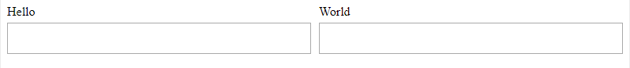
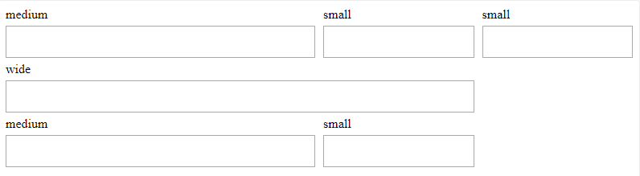
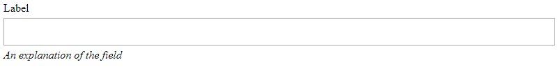

# 🤸 field-day

No one wants to spend hours thinking about how to align fields in a form, so I did it for you.


**Table of Contents**
- [field-day](#field-day)
  - [Introduction](#introduction)
  - [What's in the box](#whats-in-the-box)
    - [`<Field>`](#field)
    - [`<Field.Group>`](#fieldgroup)
    - [Customizing Behavior](#customizing-behavior)
  - [How does it work?](#how-does-it-work)

## Introduction

Forms can be a pain to align correctly. It's easy enough to make a grid of fields, but what happens when you add labels? When those labels overflow to multiple lines? When you want some fields to span multiple columns?

`field-day` provides a config-free sane field grid experience, plus all the power tools you need to implement your own specialized field structures.

It looks like this:



```js
import Field from 'field-day';

<Field.Group>
  <Field label="Hello">
    <Input />
  </Field>
  <Field label="World">
    <Input />
  </Field>
</Field.Group>;
```

Or like this:



```js
<Field.Group columns={4}>
  <Field label="medium" columnSpan={2}>
    <Input />
  </Field>
  <Field label="small">
    <Input />
  </Field>
  <Field label="small">
    <Input />
  </Field>
  <Field label="wide" columnSpan={3}>
    <Input />
  </Field>
  <Field label="medium" columnSpan={2}>
    <Input />
  </Field>
  <Field label="small">
    <Input />
  </Field>
</Field.Group>
```

... and that's only scratching the surface of the options available.

## What's in the box

### `<Field>`

**Props**

| Prop Name        | Type | Description                                                                                                                                                   |
| ---------------- | ------------------------ | ------------------------------------------------------------------------------------------------------------------------------------- |
| `columnSpan`    | `number` | Controls the number of columns this field will take up in the layout. If two adjacent fields are too wide to fit together on a row, the second one will wrap. |
| `children` | `string | Node` | The contents to render within the Field, usually an input of some sort. |
| `label` | `string | Node` | In a default Field, you can pass a string or node to `label` to render the contents of the label above the field children. |
| `fieldId` | `string` | In a default Field, you can pass an explicit id string to indicate the id applied to your input, and the label will use it as a `for` attribute. |
| `align` | `string` | In a default Field, this prop will align the content of your field within the available space. Can be `start`, `end`, `stretch`, `center`; defaults to `stretch`. |

**Static properties**

| Property | Description |
| - | - |
| Group | A convenience reference for the FieldGroup component which MUST wrap all fields as a direct parent. |

By default, `Field` renders a label and content pair. The label is placed above the content. They are placed 5px from each other vertically. However, _all_ of these details are customizable.

As a bonus, in addition to the `fieldId` behavior mentioned above, the default Field label will take a look at the `childen` you pass into the `Field` itself and see if it's a node with an `id` prop. If it is, the label will automatically use that as its `for` attribute.

### `<Field.Group>`

**Props**

| Prop Name | Type | Description |
| - | - | - |
| `columns` | `number` | The number of columns in the grid. Defaults `2` |
| `children` | `Array<Field>` | Children of a `FieldGroup` must be `Field`s, and all `Field` components must be rendered directly inside a `FieldGroup`* |
| `fieldElementVerticalSpacing` | `CSSValue` | A string CSS value which determines the amount of space between elements inside a field, vertically.
| `fieldHorizontalSpacing` | `CSSValue` | A string CSS value which determines the amount of space between fields, horizontally.
| `fieldElements` | `Array<FieldElementConfig>` | _Advanced_: Customize the behavior of the elements within a field by supplying customized configs for each field element. This allows changing element heights and vertical alignment of elements. Specifying `fieldElements` is **required** if you customize the rendering of `Field`s inside this `Group`. |

>\* You could probably actually render a Field nested within a Group, but only if none of the components between the Group and Field actually render DOM nodes. Field layout is reliant on the Field content being a direct child of the Group DOM element.

**Static Properties**
| Property | Description |
| defaultFieldElements | _Advanced_: The default configurations which Field uses to render its contents. Useful for extending if you customize the way Field contents align, or what constitutes a Field. |

### Customizing Behavior

This library allows you to specify advanced custom behaviors, building on top of the layout framework it provides.

Here are some things you can do:

* Reorder label and content
* Remove elements (label, content) or add your own custom elements
* Change how elements align vertically
* Change the spacing between elements

To do any of these things, you'll need to override a `Field.Group`'s `fieldElements` prop.

`fieldElements` is an array of `FieldElementConfig` objects, which look like this:

```js
{
  height: 'auto',
  verticalAlign: 'center',
  render: ({ fieldProps, style }) =>
    fieldProps.children && <div style={style}>{fieldProps.children}</div>,
}
```

What you see above is actually the default `FieldElementConfig` for the content of a field.

The `height` of an element determines the characteristics of its row in the grid. `auto` just means a row will grow or shrink to fit the horizontal siblings of that element (so, if there was a `100px` tall input in this row of fields, all of the content areas would be `100px` tall). You can also enforce a static height (then, even if there are no elements at all, the space will still be there). I recommend using the CSS `minmax` function, which will establish a sane minimum while allowing contents to grow dynamically if you do something like `minmax(20px, auto)`.

The `verticalAlign` of an element determines how it 'sticks' vetically to its fellow field elements. This makes a big difference as adjacent elements vary in size. For instance, if the label in the next column is `100px` high, and you want your label to 'stick' to the bottom of the created area so that it sits just above the input, you'd want to use `verticalAlign: 'end'` (this is the default behavior for labels, by the way). `center`, `stretch`, `start` are all also options (or, technically, anything you could supply to the `align-self` CSS property).

Finally, the `render` function. This does all the work of actually rendering the element based on the available information in the Field. It's passed a single object, `{ style, fieldProps }`. You **must** apply `style` to the top-level DOM element of your field element. After that, you're free to do whatever you like utilizing `fieldProps`, which are **all the props passed to your field**. That means you can pass custom props to your field and use them when rendering your custom field elements, letting you craft your own component API.

As an example, let's add a "Help Text" element to our fields. The help text should sit below the input, 'sticking' to the bottom of it. It shouldn't be more than 20px high at most. And we want to render it using italics, getting its content from a `helpText` prop we supply to our Field.

```js
const customFieldElements = [
  // we spread in the default elements; we still want those
  ...Field.Group.defaultFieldElements,
  // our 'helptext' custom element
  {
    height: 'minmax(auto, 20px)',
    verticalAlign: 'top',
    render: ({ style, fieldProps }) =>
      fieldProps.helpText && <i style={style}>{fieldProps.helpText}</i>,
  },
];

const rendered = (
  <Field.Group fieldElements={customFieldElements}>
    <Field label="Label" helpText="An explanation of the field">
      <Input />
    </Field>
    <Field label="Label 2">
      <Input />
    </Field>
  </Field.Group>
);
```

That wasn't so hard! We can now easily pass through a `helpText` prop to our fields and get a nicely rendered help text element:



Now, what if we want _all_ our field groups to behave this way? Well, we can create our own copy of `Field` and `FieldGroup` in our project using `recompose`'s `withProps`.

```js
import Field from 'field-day';
import { withProps } from 'recompose';

Field.Group = withProps({
  fieldElements: customFieldElements,
})(Field.Group);

export default Field;
```

Nice!

## How does it work?

`field-day` uses CSS grid to generate its field layout grid, and then manages keeping track of columns, column spans, and assigning the correct CSS properties to children for you.

Inspect the generated DOM to see the gist of how things get aligned.

`field-day` has no dependencies, so it's pretty lightweight. And it utilizes native CSS, not costly Javascript alignment, so it's quick, too!
